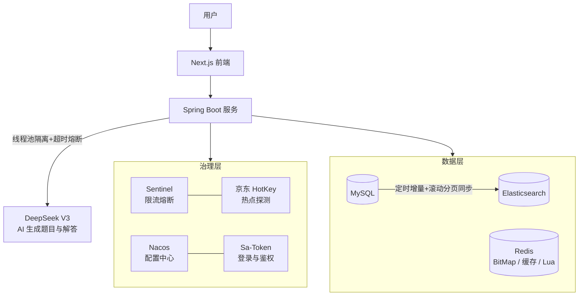

# AI 题境

**AI 智能刷题平台** —— AI 生成题目 · 多级缓存 · 检索治理 · 安全防护

    

> 面向编程求职者的智能刷题平台：接入 DeepSeek V3 自动生成题目与解答，配合分词检索、BitMap 刷题记录与多层安全防护。

## 系统架构



## 核心亮点

### 1. AI 生成链路治理
- 接入火山方舟（DeepSeek V3）实现题目与解答自动生成
- **线程池隔离 + 超时熔断 + 降级返回预生成题目**，AI 模块故障不影响核心刷题链路
- MyBatis Plus batch 分批插入 + `CompletableFuture` 异步编排，10 道题目"生成 + 入库"耗时 **43s → 19s**

### 2. 高性能设计
- **Redis BitMap** 年度刷题记录：1 万用户 × 365 天仅约 450KB，较数据库行存节省数百倍空间；本地缓存 + 位运算合并返回，减少网络往返
- **Elasticsearch** 替代 MySQL 模糊查询：IK 分词器 + 自定义词典；定时增量 + 滚动分页（游标式）数据同步，规避深分页的重复/遗漏
- **ES 宕机自动降级**查询数据库 / 缓存，检索链路可用性保障
- 京东 **HotKey** 热点探测，自动发现并本地缓存热点题目

### 3. 安全防护体系
- **Sa-Token** 同端互斥登录 + 懒惰式多端登录提醒（避免轮询开销）
- 滑动窗口 + **Lua 脚本**（原子性）实现访问频率统计与分级反爬：告警 → 自动封禁
- **WebFilter + BloomFilter** 拦截黑名单 IP，规则经 Nacos 配置中心动态热更新

### 4. 工程效率
- **Sentinel** 热点参数限流 + 接口熔断（fallback 返回本地缓存），规则 Push 模式持久化
- 自定义注解统一封装 HotKey 探测、分布式锁、反爬校验，消除重复样板代码

## 技术栈

Spring Boot 2.7 / MyBatis Plus / MySQL / Redis + Redisson / Elasticsearch / Sentinel / Nacos / 京东 HotKey / Sa-Token / 火山方舟（DeepSeek V3）/ 腾讯云 COS

## 快速开始

```bash
# 1. 准备 MySQL / Redis / Elasticsearch / Nacos 环境
# 2. 在 application-local.yml 配置本地凭证（不入库）
# 3. 启动
mvn spring-boot:run
```

## 项目结构

```
src/main/java
├── aop/           # 权限 / 反爬 / 分布式锁 / 热点探测拦截器
├── blackfilter/   # IP 黑名单过滤器（Nacos 动态规则）
├── controller/    # 用户 / 题目 / 题库 / 点赞收藏 / 公众号
├── esdao/         # ES 数据访问层
├── job/cycle/     # 增量数据同步任务
├── manager/       # AI 调用管理器（AiManager）
├── sentinel/      # 限流熔断规则管理
└── ThreadPool/    # 线程池隔离（AI / 数据库）
```

## Roadmap

- [ ] AI 生成题目改 RocketMQ 异步解耦（削峰 + 失败重试）
- [ ] Canal 监听 binlog 实现 MySQL → ES 实时同步
- [ ] 接入 JMeter 压测报告（QPS / P99 基线）

---

*本项目为个人学习与工程实践项目，欢迎交流：321289707@qq.com*
